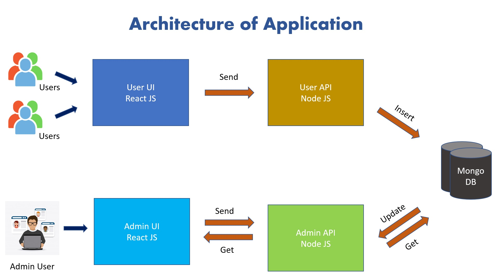
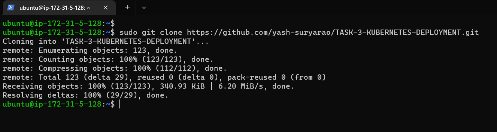

# TASK-3-KUBERNETES-DEPLOYMENT

**Company**: CODETECH IT SOLUTION  
**Name**: YASH SURYARAO  
**Intern ID**: _[Your ID]_  
**Domain**: DEVOPS  
**Duration**: 8 WEEKS  
**Mentor**: NEELA SANTOSH  

---

## Project Overview

In this project, I deployed a Call Booking Microservice Application on a Kubernetes cluster using Amazon EKS (Elastic Kubernetes Service). This involved creating Docker images, pushing them to AWS ECR, and applying Kubernetes manifests to deploy services like admin-api, user-api, and a MongoDB database. Below is the complete documentation of each step I performed.

---

## Application Architecture


---

## 🛠️ Prerequisites

- AWS Account & EKS Cluster
- `kubectl`, `eksctl`, `aws` CLI installed and configured
- Docker and Helm installed locally
- AWS credentials with ECR/EKS permissions

---

### Step 1: Docker Installation

```bash
sudo apt-get update
sudo apt-get install docker.io -y
sudo systemctl start docker
sudo systemctl enable docker
```
Check the Docker version:
```bash
docker --version
```

---

### Step 2. Clone Repository and Build Microservices

```bash
git clone https://github.com/yash-suryarao/TASK-3-KUBERNETES-DEPLOYMENT.git
```


### Step 3. Create and push images to AWS ECR

#### 1. Create an IAM Role:

Start by creating an IAM role that has the necessary permissions to access ECR. You can define the required permissions in an IAM policy and attach it to the role. The policy should include permissions for ECR actions like `ecr:BatchCheckLayerAvailability`, `ecr:GetAuthorizationToken`, and `ecr:GetDownloadUrlForLayer`.

#### 2. Launch EC2 Instance with IAM Role:

Launch an EC2 instance and associate it with the IAM role you created in the previous step. During the EC2 instance launch process, you can choose the IAM role under the "Configure Instance" section.

#### 3. Retrieve and Use ECR Authorization Token:

Within your EC2 instance, you need to retrieve an authorization token from ECR, which includes the necessary credentials for authentication. You can use the AWS Command Line Interface (CLI) or an SDK to accomplish this.

Here's an example using the AWS CLI:
```bash
aws ecr get-login-password --region <your_region> | docker login --username AWS --password-stdin <your_account_id>.dkr.ecr.<your_region>.amazonaws.com
```
This command retrieves an authentication token and uses it to log in to the ECR repository. Replace <your_region> with your AWS region and <your_account_id> with your AWS account ID.

#### 4. Push and Run Docker Images:

After authentication, you can use standard Docker commands to push and run Docker images from your ECR repository. For example, you can use the docker push command to retrieve the desired image, and then run it using docker run.

Create ECR Repository:
```bash
aws ecr create-repository --repository-name admin-api
```
Tag and Push Docker Image:
```bash
docker tag admin-api:v1.0 <account_id>.dkr.ecr.ap-south-1.amazonaws.com/admin-api:v1.0
docker push <account_id>.dkr.ecr.ap-south-1.amazonaws.com/admin-api:v1.0
```
Repeat for other microservices admin-ui, user-api, and user-ui.


