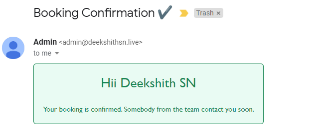

# TASK-3-KUBERNETES-DEPLOYMENT

**Company**: CODETECH IT SOLUTION  
**Name**: YASH SURYARAO  
**Intern ID**: _[Your ID]_  
**Domain**: DEVOPS  
**Duration**: 8 WEEKS  
**Mentor**: NEELA SANTOSH  

---

## Project Overview

In this project, I deployed a Call Booking Microservice Application on a Kubernetes cluster using Amazon EKS (Elastic Kubernetes Service). This involved creating Docker images, pushing them to AWS ECR, and applying Kubernetes manifests to deploy services like admin-api, user-api, and a MongoDB database. Below is the complete documentation of each step I performed.

---

## Application Architecture


---

## 🛠️ Prerequisites

- AWS Account & EKS Cluster
- `kubectl`, `eksctl`, `aws` CLI installed and configured
- Docker and Helm installed locally
- AWS credentials with ECR/EKS permissions

---

### Step 1: Docker Installation

```bash
sudo apt-get update
sudo apt-get install docker.io -y
sudo systemctl start docker
sudo systemctl enable docker
```
Check the Docker version:
```bash
docker --version
```

---

### Step 2. Clone Repository and Build Microservices

```bash
git clone https://github.com/yash-suryarao/TASK-3-KUBERNETES-DEPLOYMENT.git
```


### Step 3. Create and push images to AWS ECR

#### 1. Create an IAM Role:

Start by creating an IAM role that has the necessary permissions to access ECR. You can define the required permissions in an IAM policy and attach it to the role. The policy should include permissions for ECR actions like `ecr:BatchCheckLayerAvailability`, `ecr:GetAuthorizationToken`, and `ecr:GetDownloadUrlForLayer`.

#### 2. Launch EC2 Instance with IAM Role:

Launch an EC2 instance and associate it with the IAM role you created in the previous step. During the EC2 instance launch process, you can choose the IAM role under the "Configure Instance" section.

#### 3. Retrieve and Use ECR Authorization Token:

Within your EC2 instance, you need to retrieve an authorization token from ECR, which includes the necessary credentials for authentication. You can use the AWS Command Line Interface (CLI) or an SDK to accomplish this.

Here's an example using the AWS CLI:
```bash
aws ecr get-login-password --region <your_region> | docker login --username AWS --password-stdin <your_account_id>.dkr.ecr.<your_region>.amazonaws.com
```
This command retrieves an authentication token and uses it to log in to the ECR repository. Replace <your_region> with your AWS region and <your_account_id> with your AWS account ID.

#### 4. Push and Run Docker Images:

After authentication, you can use standard Docker commands to push and run Docker images from your ECR repository. For example, you can use the docker push command to retrieve the desired image, and then run it using docker run.

Create ECR Repository:
```bash
aws ecr create-repository --repository-name admin-api
```
Tag and Push Docker Image:
```bash
docker tag admin-api:v1.0 <account_id>.dkr.ecr.ap-south-1.amazonaws.com/admin-api:v1.0
docker push <account_id>.dkr.ecr.ap-south-1.amazonaws.com/admin-api:v1.0
```


Repeat for other microservices admin-ui, user-api, and user-ui.


---

### Step 4. Create an Amazon EKS Cluster

#### 1. Create IAM Role for EKS
Use AWS Console or CLI to create a role with `AmazonEKSClusterPolicy`.

#### 2. Navigate to Amazon EKS:
Once you're logged in, go to the AWS EKS console by searching for "EKS" in the AWS services search bar or by selecting "Elastic Kubernetes Service" under the "Containers" section.

#### 3. Create an EKS Cluster:
a. Click the "Create cluster" button to start the cluster creation process.
b. In the "Create EKS cluster" wizard, you'll need to configure several settings:

- Cluster name: Provide a unique name for your EKS cluster.
- Kubernetes version: Select the desired Kubernetes version for your cluster.
- Role for cluster: You need to create or choose an IAM role that EKS can assume to manage resources on your behalf. If you don't have an appropriate role, you can create one during this step.
```bash
Navigate to IAM service --> Create new role --> choose AWS Service and select usecase dropdown to EKS service -->

Then choose EKS - Cluster --> click on NEXT --> Provide proper name --> click on create 
```
- VPC: Choose an existing Amazon VPC or create a new one for your EKS cluster. Ensure that your - VPC has the necessary subnets, security groups, and route tables set up for EKS.
- Subnets: Select the subnets in your VPC where your worker nodes will be launched.
- Endpoint access: Choose whether to allow or deny public access to the Kubernetes API server. This depends on your security requirements.
- Logging: Configure Amazon CloudWatch logging for your EKS cluster if needed.

c. After configuring these settings, click the "Create" button to create your EKS cluster.

#### 4. Wait for Cluster Creation:
EKS will now start provisioning your cluster.

This process may take several minutes to complete. You can monitor the progress on the EKS console.


#### 5. Once the cluster is active then start creating node group
a. create role for node group
```bash
Navigate to IAM service --> Create new role --> choose AWS Service and select usecase dropdown to EC2 service -->

Then choose policies --> AmazonEC2ContainerRegistryReadOnly, AmazonEKS_CNI_Policy, AmazonEKSWorkerNodePolicy --> Provide proper name --> Create  
```
b. Create node group
```bash
Navigte EKS cluster --> click on eks cluster --> navigate node groups --> click Add node group --> provide required info & create node group
```


---

### Step 5: Configure Kubectl

#### 1. Configure AWS Credentials:
- Create access key and secret key with user which eks cluster is created with.
- Use `aws configure` and provide information for all the prompts.
- Execute below command which updates kube config file, which to connect k8s cluster
```bash
aws eks update-kubeconfig --region <your_region> --name <your_cluster_name>
```
- Once kubeconfig file updated, execute command kubectl get nodes which should show all the nodes in the cluster.

---

### Step 6: Create Namespaces & Secrets

```bash
kubectl create namespace admin
kubectl create namespace user
kubectl create namespace db

kubectl create secret generic admin-api-secrets \
  --from-literal=MONGO_URL=mongodb://mongo-0.mongo.db.svc.cluster.local:27017/admin \
  -n admin
```


---

### Step 7: Kubernetes Manifests

Create MongoDB StatefulSet (db/mongo.yaml)
```bash
apiVersion: apps/v1
kind: StatefulSet
metadata:
  name: mongo
  namespace: db
spec:
  serviceName: "mongo"
  replicas: 1
  selector:
    matchLabels:
      app: mongo
  template:
    metadata:
      labels:
        app: mongo
    spec:
      containers:
      - name: mongo
        image: mongo:4.4
        ports:
        - containerPort: 27017
          name: mongo
        volumeMounts:
        - name: mongo-pvc
          mountPath: /data/db
  volumeClaimTemplates:
  - metadata:
      name: mongo-pvc
    spec:
      accessModes: [ "ReadWriteOnce" ]
      resources:
        requests:
          storage: 1Gi
```

Admin API Deployment (admin-api/deploy.yaml)

```bash
apiVersion: apps/v1
kind: Deployment
metadata:
  name: admin-api
  namespace: admin
spec:
  replicas: 1
  selector:
    matchLabels:
      app: admin-api
  template:
    metadata:
      labels:
        app: admin-api
    spec:
      containers:
      - name: admin-api
        image: <your_ecr_url>/admin-api:v1.0
        ports:
        - containerPort: 1004
        env:
        - name: MONGO_URL
          valueFrom:
            secretKeyRef:
              name: admin-api-secrets
              key: MONGO_URL
        securityContext:
          runAsNonRoot: true
          runAsUser: 1001
          runAsGroup: 1001
```

Admin API Service (admin-api/svc.yaml)

```bash
apiVersion: v1
kind: Service
metadata:
  name: admin-api-svc
  namespace: admin
spec:
  type: NodePort
  selector:
    app: admin-api
  ports:
  - port: 1004
    targetPort: 1004
    nodePort: 30004
```

---

### Step 8: Apply Configurations
```bash
kubectl apply -f mongo/
kubectl apply -f admin-api/
kubectl get pods -n admin
kubectl get svc -n admin
```

Repeat the same process for `user-api` deployment and service.


### Step 9: Test The APIs

#### Admin UI
- Application run on port ```3000```
- ADMIN UI Application to connect with ADMIN API, it expects .env file ( below should the data in .env file )
```bash
REACT_APP_API_URL= <url_of_user_api_application>
```
- Command to build the application ```npm install```
- Command to start the application ```npm start```
- To check application health there is a endpoint which is  ```http://machine-ip:port/health```

##### Admin Login

#####  Admin UI after login


#### User UI
- run on port ```3000```
- USER UI Micro service to connect with USER API, it expects .env file ( below should the data in .env file )
```
REACT_APP_API_URL= <url_of_user_api_application>
```
- Command to build ```npm install```
- Command to start ```npm start```
- To check micro service health there is a endpoint which is  ```http://machine-ip:port/health```

##### User Registration Page

##### Below is the mail format which will be sent to user who booked call

##### Below is the mail format which will be admin upon booking the call


---

### Final Result

All microservices, including MongoDB, Admin API, and User API, were successfully deployed on the EKS cluster. The application is now fully containerized, secured, and accessible externally via NodePort.

---

### Best Practices Followed

- Used StatefulSet for MongoDB

- Applied Secrets for sensitive credentials

- Deployed with non-root users for enhanced security

- Enabled readiness/liveness probes

- Managed resources using namespaces

---

### Conclusion

This project gave me hands-on experience with deploying microservices on AWS EKS using Kubernetes best practices. I learned how to containerize apps, manage infrastructure, and ensure secure, scalable deployments.
